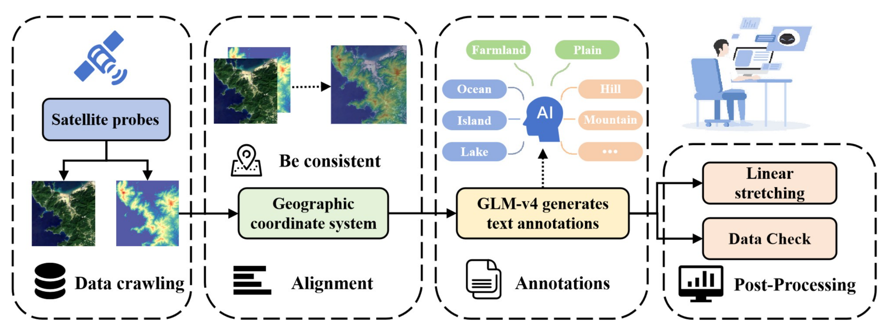
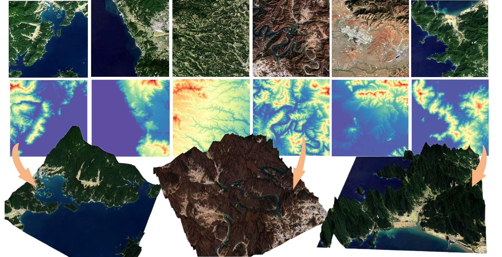

# Dataset Creation Pipeline



## Introduction

We introduce a novel benchmark designed to propel the advancement of general-purpose, large-scale 3D vision models for remote sensing imagery. This dataset encompasses 54,951 pairs of remote sensing images and pixel-level aligned depth maps, accompanied by corresponding textual descriptions, spanning a broad array of geographical contexts. It serves as a tool for training and assessing 3D visual perception models within remote sensing image spatial understanding tasks. 

Furthermore, we introduce a remotely sensed depth estimation model derived from stable diffusion, harnessing its multimodal fusion capabilities, thereby delivering state-of-the-art performance on our dataset. Our endeavor seeks to make a profound contribution to the evolution of 3D visual perception models and the advancement of geographic artificial intelligence within the remote sensing domain.

## Dataset Download and Processing Workflow

### 1. Download DEM Data

First, download the corresponding DEM dataset from sources like the Alos 3D DEM website. After downloading, place the DEM dataset in the root directory and rename it to `DataDEM-{targetAreaName}`, where `{targetAreaName}` is the name of your target geographical area (Or whatever you want to call it).

### 2. Run `Dataset-multiProcess.py`

Run the `Dataset-multiProcess.py` script to begin processing. Pay attention to the following parameters:

- **tile_size_x** and **tile_size_y**: These control the size of the DEM tiles (default is 512x512). Avoid making them too large to prevent exceeding the download limits of Google Earth Engine (GEE).
- **thread_num**: The number of threads for downloading. It is recommended to set it to a multiple of 10.
- **self.SCALE**: This should be set according to the DEM resolution. Fine-tune it to ensure that the downloaded RGB and DEM files are the same size. For example, if the DEM resolution is 30 meters, set `self.SCALE` to 30.95.
- **start_index**: Specify the index from which to start the download.

Make sure to set up your own GEE project and configure the proxy settings accordingly.

The script will first read and crop the DEM files from `DataDEM-{targetAreaName}/` into smaller DEM tiles, which are stored in `preSplitDEM-{targetAreaName}`. It will then assign tasks to each thread based on the number of DEM tiles in `preSplitDEM-{targetAreaName}`. During the RGB data download, the script will create several folders in the root directory corresponding to the number of threads, including:

- `preSplitImages-{targetAreaName}_{thread_id}`: Contains the downloaded RGB files.
- `DEM-{targetAreaName}_{thread_id}`: Contains the cropped DEM files.
- `Image/tif-{targetAreaName}_{thread_id}`: Contains the cropped TIF files.

Once the download is complete, run the `moveImgToTargetDir.py` script to move the images from the temporary folders to the final directories and remove the temporary folders. Ensure you configure the `thread_num` and `targetAreaName` parameters.

### 3. Convert TIF to PNG

Next, navigate to the `utils` directory and run the `tif2png.py` script to normalize and convert the TIF images to PNG format:

```bash
cd utils
python tif2png.py
````

Configure the following parameters:

* **normalization255**: Set to `False` if you do not want to normalize the images to a 0-255 range.
* **rgbSingleNormalized**: Set to `True` if you want to normalize each RGB channel separately to 0-255.
* **original**: Set to `False` to avoid multiplying the original data by 255.
* **linearExtend**: Set to `1` for linear stretching (set to `0` to disable).

### 4. Check Output

After the script finishes, a folder named `png-stretched-{targetAreaName}` will be created in the root directory, containing the normalized and linear stretched PNG images. You should review the output and remove any anomalies from the dataset.

### 5. Normalize DEM to 255

Run the `dem255.py` script to normalize the DEM files in the `DEM-{targetAreaName}` folder to a 0-255 range. The normalized DEM files will be saved in the `DEM_255-{targetAreaName}` folder, automatically excluding any previously removed anomalous data.

```bash
cd utils
python dem255.py
```

### 6. Final Dataset

Upon successful completion of all the steps, you will have the following dataset pairs:

* `png-stretched-{targetAreaName}` (RGB Images in PNG format)
* `DEM-{targetAreaName}` (Original DEM files)
* `DEM_255-{targetAreaName}` (Normalized DEM files)

## Final Result



By following the steps outlined above, you will have a complete dataset ready for training and evaluation of 3D visual perception models in remote sensing applications. This pipeline ensures that the dataset is properly processed and formatted for use with large-scale 3D vision models.


### Additional Utilities

#### `Utils/3Dgenerate.py`: Generate 3D Point Cloud Visualization from RGB-DEM Pairs

This script allows you to generate 3D point cloud visualizations from RGB-DEM pairs. It helps in converting the depth information from the DEM files into a 3D representation, which can be useful for visually inspecting the dataset and understanding the spatial structure of the data.

To run this script, use:

```bash
python Utils/3Dgenerate.py
````

This will create a 3D point cloud visualization from the RGB and DEM images in the dataset.

#### `Utils/checkDatasetUI-New.py`: Visualize Multiple Image Dataset

This script provides an interactive user interface for viewing multiple images within the dataset. It supports mouse and keyboard navigation (using `WASD` for up/down movement and zooming for closer inspection of individual pixels). Additionally, it allows you to quickly skip images and view the original depth map information associated with the images.

To run this script, use:

```bash
python Utils/checkDatasetUI-New.py
```

This tool will be helpful for manually inspecting the dataset to identify any issues or anomalies in the images or depth maps.

#### `Utils/convertDepth2Color.py`: Convert Grayscale Depth Maps to Color Depth Maps

This utility script can convert single-channel grayscale depth maps into colorized depth maps. The color mapping helps in better visualizing depth variations, making it easier to analyze the depth information in the dataset.

To run this script, use:

```bash
python Utils/convertDepth2Color.py
```

This will generate colorized depth maps from the original grayscale depth maps, which can be useful for visual inspection or for tasks requiring color-depth information.

```

This addition should provide users with a clear understanding of the additional utilities available in your pipeline, including how to run and what each utility does.
```
